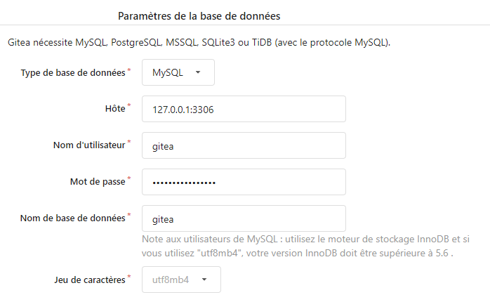
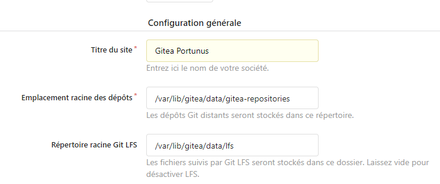
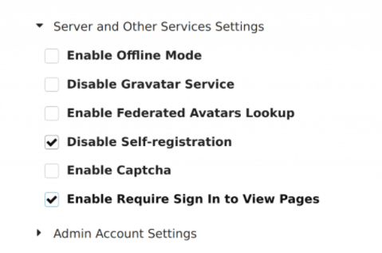
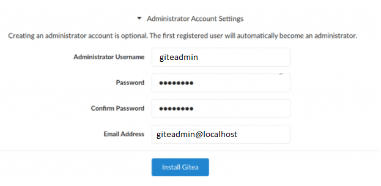

# infr-gitea
#### 1. Mettre à jour et installer les packages
```console
alex@server:~$ sudo apt -y update | sudo apt -y upgrade
```
```console
alex@server:~$ sudo apt -y install git vim bash-completion
```

#### 2. Ajouter le compte git
```console
alex@server:~$ sudo adduser \
   --system \
   --shell /bin/bash \
   --gecos 'Git Version Control' \
   --group \
   --disabled-password \
   --home /home/git \
   git
```

#### 2. Installer et configuration de MariaDB
```console
alex@server:~$ sudo apt -y install mariadb-server
```

Lancer la configuration de MariaDB
```console
alex@server:~$ $ sudo mysql_secure_installation 

NOTE: RUNNING ALL PARTS OF THIS SCRIPT IS RECOMMENDED FOR ALL MariaDB
      SERVERS IN PRODUCTION USE!  PLEASE READ EACH STEP CAREFULLY!

In order to log into MariaDB to secure it, we'll need the current
password for the root user.  If you've just installed MariaDB, and
you haven't set the root password yet, the password will be blank,
so you should just press enter here.

Enter current password for root (enter for none): 
OK, successfully used password, moving on...

Setting the root password ensures that nobody can log into the MariaDB
root user without the proper authorisation.

You already have a root password set, so you can safely answer 'n'.

Change the root password? [Y/n] y
New password: 
Re-enter new password: 
Password updated successfully!
Reloading privilege tables..
 ... Success!


By default, a MariaDB installation has an anonymous user, allowing anyone
to log into MariaDB without having to have a user account created for
them.  This is intended only for testing, and to make the installation
go a bit smoother.  You should remove them before moving into a
production environment.

Remove anonymous users? [Y/n] y
 ... Success!

Normally, root should only be allowed to connect from 'localhost'.  This
ensures that someone cannot guess at the root password from the network.

Disallow root login remotely? [Y/n] y
 ... Success!

By default, MariaDB comes with a database named 'test' that anyone can
access.  This is also intended only for testing, and should be removed
before moving into a production environment.

Remove test database and access to it? [Y/n] y
 - Dropping test database...
 ... Success!
 - Removing privileges on test database...
 ... Success!

Reloading the privilege tables will ensure that all changes made so far
will take effect immediately.

Reload privilege tables now? [Y/n] y
 ... Success!

Cleaning up...

All done!  If you've completed all of the above steps, your MariaDB
installation should now be secure.

Thanks for using MariaDB!$ sudo mysql_secure_installation 

NOTE: RUNNING ALL PARTS OF THIS SCRIPT IS RECOMMENDED FOR ALL MariaDB
      SERVERS IN PRODUCTION USE!  PLEASE READ EACH STEP CAREFULLY!

In order to log into MariaDB to secure it, we'll need the current
password for the root user.  If you've just installed MariaDB, and
you haven't set the root password yet, the password will be blank,
so you should just press enter here.

Enter current password for root (enter for none): 
OK, successfully used password, moving on...

Setting the root password ensures that nobody can log into the MariaDB
root user without the proper authorisation.

You already have a root password set, so you can safely answer 'n'.

Change the root password? [Y/n] y
New password: 
Re-enter new password: 
Password updated successfully!
Reloading privilege tables..
 ... Success!


By default, a MariaDB installation has an anonymous user, allowing anyone
to log into MariaDB without having to have a user account created for
them.  This is intended only for testing, and to make the installation
go a bit smoother.  You should remove them before moving into a
production environment.

Remove anonymous users? [Y/n] y
 ... Success!

Normally, root should only be allowed to connect from 'localhost'.  This
ensures that someone cannot guess at the root password from the network.

Disallow root login remotely? [Y/n] y
 ... Success!

By default, MariaDB comes with a database named 'test' that anyone can
access.  This is also intended only for testing, and should be removed
before moving into a production environment.

Remove test database and access to it? [Y/n] y
 - Dropping test database...
 ... Success!
 - Removing privileges on test database...
 ... Success!

Reloading the privilege tables will ensure that all changes made so far
will take effect immediately.

Reload privilege tables now? [Y/n] y
 ... Success!

Cleaning up...

All done!  If you've completed all of the above steps, your MariaDB
installation should now be secure.

Thanks for using MariaDB!
```

#### 3. Configuration de Gitea sur MariaDB
Se connecter sur MariaDB
```console
alex@server:~$ sudo mysql -u root -p
```
Créer la base de données gitea
```console
CREATE DATABASE gitea;
```
Associer la base à un utilisateur
```console
GRANT ALL PRIVILEGES ON gitea.* TO 'gitea'@'localhost' IDENTIFIED BY "YOUR_PASSWORD";
```
Appliquer les nouveaux droits
```console
FLUSH PRIVILEGES;
```
Quitter la session SQL
```console
QUIT;
```

#### 4. Installation de Gitea
Télécharger le dernier package sur [Downloads page](https://github.com/go-gitea/gitea/releases)
ou utiliser cette commande
```console
alex@server:~$ curl -s  https://api.github.com/repos/go-gitea/gitea/releases/latest | grep browser_download_url | cut -d '"' -f 4 | grep '\linux-amd64$' | wget -i -
```
Télécharger la signature du fichier
```console
alex@server:~$ curl -s  https://api.github.com/repos/go-gitea/gitea/releases/latest | grep browser_download_url | cut -d '"' -f 4 | grep '\linux-amd64.sha256$' | wget -i -
```
Vérifier l'intégrité du fichier
```console
alex@server:~$ sha256sum -c gitea-1.16.1-linux-amd64.sha256
gitea-1.16.1-linux-amd64: Réussi
```
Déplacer l'exécutable gitea
```console
alex@server:~$ sudo mv gitea-1.16.1-linux-amd64 /usr/local/bin/gitea
```
Modifier les droits du fichier pour le rendre exécutable
```console
alex@server:~$ sudo chmod +x /usr/local/bin/gitea
```
Vérifier l'installation
```console
alex@server:~$ gitea --version
Gitea version 1.16.1 built with GNU Make 4.1, go1.17.6 : bindata, sqlite, sqlite_unlock_notify
```
Configurer les dossiers pour Gitea
```console
alex@server:~$ sudo mkdir -p /etc/gitea /var/lib/gitea/{custom,data,indexers,public,log}
alex@server:~$ sudo chown git:git /var/lib/gitea/{data,indexers,log}
alex@server:~$ sudo chmod 750 /var/lib/gitea/{data,indexers,log}
alex@server:~$ sudo chown root:git /etc/gitea
alex@server:~$ sudo chmod 770 /etc/gitea
```
#### 5. Configuration du service pour Gitea
Créer le fichier /etc/systemd/system/gitea.service
```ini
[Unit]
Description=Gitea (Git with a cup of tea)
After=syslog.target
After=network.target
After=mysql.service

[Service]
LimitMEMLOCK=infinity
LimitNOFILE=65535
RestartSec=2s
Type=simple
User=git
Group=git
WorkingDirectory=/var/lib/gitea/
ExecStart=/usr/local/bin/gitea web -c /etc/gitea/app.ini
Restart=always
Environment=USER=git HOME=/home/git GITEA_WORK_DIR=/var/lib/gitea

[Install]
WantedBy=multi-user.target
```
Recharger systemd
```console
alex@server:~$ sudo systemctl daemon-reload
```
Activer le service gitea
```console
alex@server:~$ sudo systemctl enable --now gitea
```
Vérifier l'état du service
```console
alex@server:~$ systemctl status gitea
● gitea.service - Gitea (Git with a cup of tea)
   Loaded: loaded (/etc/systemd/system/gitea.service; enabled; vendor preset: enabled)
   Active: active (running) since Sun 2022-02-07 07:37:06 UTC; 27s ago
 Main PID: 2637 (gitea)
    Tasks: 9 (limit: 4719)
   Memory: 93.8M
   CGroup: /system.slice/gitea.service
           └─2637 /usr/local/bin/gitea web -c /etc/gitea/app.ini
```
#### 6. Configuration du proxy Nginx
Installer nginx
```console
alex@server:~$ sudo apt -y install nginx
```
Créer et éditer le fichier /etc/nginx/conf.d/gitea.conf
```ini
server {
    listen 80;
    server_name URL_SERVER;

    location / {
        proxy_pass http://localhost:3000;
    }
}
```
Redémarrer nginx
```console
alex@server:~$ sudo systemctl restart nginx
```
#### 7. Configuration Gitea depuis l'interface web
Se connecter sur http://URL_SERVER/install pour accéder à l'interface d'installation

Renseigner les informations de la base de données configurée plus haut


Vous pouvez changer le nom du git dans la configuration générale


Dans _Server and Other Services Settings_, cocher Disable Self-registration pour éviter les inscriptions automatiques


Configurer les identifiants du compte administrateur de Gitea


Cliquer sur Install Gitea une fois tout configuré
